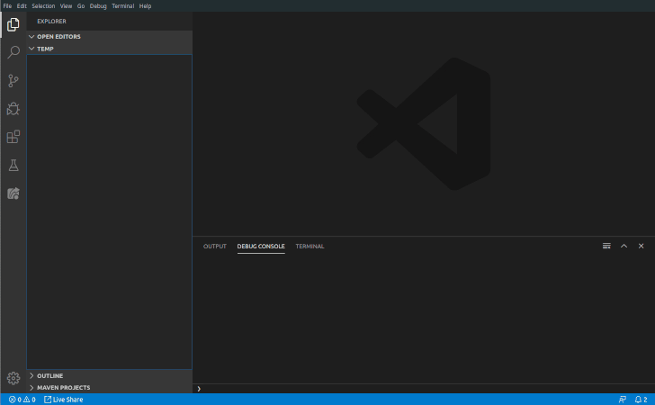

<h3 align="center">TFS - Default Project Structure Helper</h3>
 
## Sobre o Projeto

Esta extensão tem como objetivo ajudar e padronizar a criação de um novo projeto em React ou React Native, baseado em regras de estrutura e criação de componentes

### Instalação

Para instalar uma extensão você pode executar o **Command Pallete** através do comando `Ctrl + Shift + P` ou `Cmd + Shift + P`, digitar `Install Extensions` e depois aperte `Enter`.
Depois disso, o vscode vai abrir um menu na sua esquerda com um campo de busca, nele você irá digitar TFS - Default Project Structure, e nesse momento vai aparecer a extensão **TFS - Default Project Structure** 

### Linguagens Suportadas

- JavaScript (.js)
- JavaScript React (.jsx)

### Porque Usar?
Como criamos muitas telas, páginas e componentes, esse processo acaba ficando cansativo e essa extensão ajuda a resolver esse problema, deixando tudo mais simples e automático.

### Como Usar?
Depois de instalar a extensão, você deve ativar o **Command Pallete** através do comando `Ctrl + Shift + P` ou `Cmd + Shift + P` e na caixa comandos, seguir um dos itens abaixo de acordo com a sua necessidade

|                                         Comando | Efeito                                                         |
| ------------------------------------------------| -------------------------------------------------------------- |
| **`tfs-create-react-native-project-structure`** | Cria uma nova estrutra de pastas e arquivos para projetos React Native|
| **`tfs-create-react-native-default-page`** | Cria uma nova página e importa o componente de página padrão|                                             |

## Licença

Distribuído sob a licença MIT. Veja `LICENSE` para mais informações.